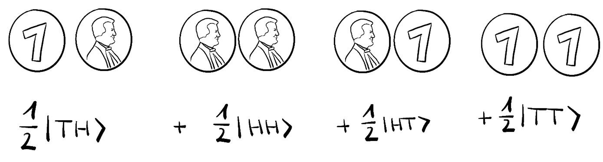

### Introduction: The Quantum Embrace

Imagine you have two special coins. You toss them, and when the first one lands on heads, the second one instantly lands on tails, no matter how far apart they are. That's a trick, right? Maybe they were secretly connected.

In the quantum world, this isn't a trick; it's a feature. This mysterious connection is called entanglement. It's the universe's most mind-bending link, where two particles become so deeply connected that they act as one, even when separated by great distances.

## What Does Entanglement Mean?

When two particles are entangled, you can't describe one without also describing the other. They lose their individual identities and become part of a single, larger system. Think of them as a team of two that always acts together.

For example, imagine two entangled particles that can either spin up or spin down. Before you look at them, their spin is undecided. But the moment you measure one and find it is spinning up, you know instantly that its partner is spinning down. This happens at the very same moment, even if the other particle is on the other side of the galaxy.

## Einstein's "Spooky Action"

The idea of this instant connection bothered Albert Einstein. He called it "spooky action at a distance" because it seemed to break the rule that nothing can travel faster than the speed of light. He thought there must be a simpler explanation.

Einstein suggested the particles had hidden properties, like a secret note inside each of them. The note would tell each particle how to behave when measured. This way, there would be no spooky action, just a predetermined outcome. But the problem was, you could never find these hidden notes.

## Proving Einstein Wrong

For many years, the debate was just a thought experiment. Then in 1964, a physicist named John Bell created a logical puzzle called Bell's inequality. It was a set of rules that had to be true if Einstein's idea of "hidden notes" was correct.

Bell showed that if the universe works with these hidden notes, the outcomes of certain measurements would always follow a certain pattern. But if the universe works the way quantum mechanics says, the pattern would be different. This was a brilliant move; it turned a philosophical argument into a scientific experiment.

## The Experiments

Starting in the 1980s, scientists began performing these experiments. The early results showed that the universe did not follow Bell's rules. It seemed to behave exactly as quantum mechanics predicted.

But some people still doubted it, pointing out small technical problems in the experiments. So, in 2015, three different teams of scientists conducted new, highly advanced experiments. They eliminated all the possible problems and proved definitively that the universe is just as "spooky" as quantum mechanics suggests.

## Why Entanglement Matters

Entanglement isn't just a weird quirk of physics; it's a powerful tool that will shape our future.

**Super-Secure Communication:** Entangled particles can be used to create an unbreakable secret code. Any attempt by a hacker to read the message would instantly break the entanglement, alerting you that someone is listening.    
**Quantum Computers:** The power of quantum computers comes from entangled particles. This allows them to solve certain problems that are too complex for today's fastest supercomputers.
**Understanding Spacetime:** Some of the most exciting new ideas in physics suggest that entanglement might be what creates the very fabric of space and time. This means that a spooky connection between particles could be what holds the universe together.

From a strange idea that puzzled Einstein to a key resource for technology, entanglement is proving that the real world is far more fantastic than we ever imagined.

## References

- Einstein, A., et al. (1935). A famous paper asking if quantum mechanics is complete.    
- Schrödinger, E. (1935). A paper that introduced the term "entanglement" to the world.
- Bell, J. S. (1964). The paper that turned a philosophical puzzle into a testable experiment.
- Aspect, A., et al. (1982). Early experiments that showed entanglement was real.
- Hensen, B., et al. (2015). One of the modern experiments that proved entanglement with no loopholes.
- Shalm, L. K., et al. (2015). A second modern experiment that confirmed the results.
- Giustina, M., et al. (2015). A third modern experiment that also proved entanglement was real.